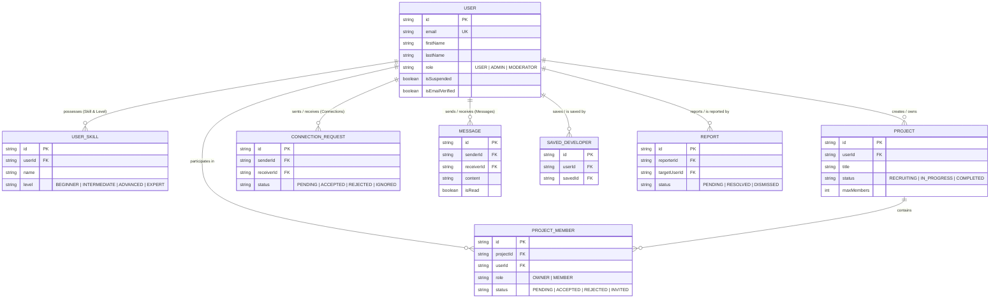

# DevTinder Backend API Architecture

```text
DevTinder
│
├── 🔐 Authentication (Completed)
├── 👤 User Profiles (Completed)
├── 🔍 Developer Discovery (Completed)
├── 🤝 Connections (Completed)
├── 💬 Messaging & WebSockets (Completed)
├── 🛠️ Projects (Completed)
├── 🌐 Community (Phase 2)
└── 👑 Administration (Completed)
```

---

## 🗄️ PostgreSQL Database ERD Architecture

```text
                               PostgreSQL
                                   │
       ┌───────────────────────────┼───────────────────────────┐
       │                           │                           │
      User                     UserSkill                    Project
       │                           │                           │
       ├───────────────────────────┤                           ├──────────────┐
       │                           │                           │              │
Connections                 SavedDeveloper               ProjectMember     Report
       │
    Messages
```

---

## 📐 Entity-Relationship Schema Map



---

## 🔐 1. Authentication & Security Flow

```text
                      User Logs In
                           │
                    Email + Password
                           │
                   Verify Credentials
                           │
                  Create Session / JWT
                           │
                  Authenticated User
                           │
        ┌──────────────────┴──────────────────┐
        │                                     │
   Role = USER                           Role = ADMIN
        │                                     │
 ├── View developers       ✅          ├── View developers       ✅
 ├── Send connection       ✅          ├── Manage users          ✅
 ├── Delete another user   ❌ (403)     ├── Delete user           ✅
 └── Access admin panel    ❌ (403)     └── Admin dashboard       ✅
```

---

## 🛡️ 2. Role Capability & Enforcement Matrix

| Feature / Action | Normal Developer (`USER`) | Platform Admin (`ADMIN`) | Middleware Guard |
| :--- | :---: | :---: | :--- |
| **View Developer Discovery** | ✅ Allowed | ✅ Allowed | `protect` |
| **Send Connection Request** | ✅ Allowed | ✅ Allowed | `protect` |
| **1-on-1 Real-time Chat** | ✅ Matched Users | ✅ Matched Users | `protect` |
| **Create & Join Projects** | ✅ Allowed | ✅ Allowed | `protect` |
| **Access Admin Dashboard** | ❌ **Forbidden (403)** | ✅ Allowed | `authorize("ADMIN")` |
| **Manage & Suspend Users** | ❌ **Forbidden (403)** | ✅ Allowed | `authorize("ADMIN")` |
| **Delete User Account** | ❌ **Forbidden (403)** | ✅ Allowed | `authorize("ADMIN")` |
| **Global Platform Settings**| ❌ **Forbidden (403)** | ✅ Allowed | `authorize("ADMIN")` |

---

## 🔑 3. Authentication Endpoints Overview

| Method | Endpoint Route | Access | Description |
| :---: | :--- | :---: | :--- |
| `POST` | `/api/auth/signup` | Public | Register new developer account with default `USER` role. |
| `POST` | `/api/auth/login` | Public | Authenticate user, issue JWT token & set HTTP-only cookie. |
| `POST` | `/api/auth/logout` | Public / Auth | Destroy session and clear cookie. |
| `GET` | `/api/auth/me` | Private | Fetch current authenticated user profile & skills. |
| `POST` | `/api/auth/forgot-password` | Public | Generate 15-minute password reset token. |
| `POST` | `/api/auth/reset-password` | Public | Reset password using valid reset token. |
| `POST` | `/api/auth/send-verification`| Private / Public | Generate 24-hour email verification token. |
| `POST` | `/api/auth/verify-email` | Public | Verify email address token. |

---

## 📄 4. Postman Collection Documentation

The complete Postman Collection JSON is exported and available at:
`[DevTinder_Authentication_Postman_Collection.json](./DevTinder_Authentication_Postman_Collection.json)`

### How to Import into Postman:
1. Open **Postman**.
2. Click **Import** in the top left.
3. Select `DevTinder_Authentication_Postman_Collection.json`.
4. Set the collection environment variable `baseUrl` to `http://localhost:8000`.


